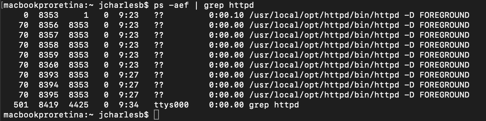

# Installer son environnement de développement sur macOS 10.14 (Mojave)
<br>
([macOS 10.14 Mojave Apache Setup…](https://getgrav.org/blog/macos-sierra-apache-multiple-php-versions))

---

## Installer _Command Line Tools_ d’Xcode (Apple IDE)

Si **Xcode** n’est pas installé sur votre ordinateur, les *command line tools* ne le sont pas non plus. Ils seront nécessaire pour qu’**Homebrew** puisse installer votre futur environnement de développement.

Ouvrez l’application **Terminal**  qui se trouve dans le dossier `/Applications/Utilitaires/Terminal.app`.

Dans la fenêtre Shell, tapez :

```
xcode-select --install
```

Lorsque cette fenêtre apparaît, choisissez **Installer**.


> L’opération peut durer plusieurs minutes…
> Si **Xcode** est déjà installé vous devrez l'avoir déjà ouvert et avoir accepté la license. Si ce n'est pas le cas, un message apparaîtra après l'installation d'**Homebrew** pour le faire et pouvoir poursuivre.

---

## Installer l'installeur de paquets _Homebrew_

Toujours dans le terminal, tapez :

```
ruby -e "$(curl -fsSL https://raw.githubusercontent.com/Homebrew/install/master/install)"
```

Et suivez les instructions :


```
return
```

Puis à l'invite, le mot de passe de votre compte administrateur.


Une fois l’installation d’Homebrew terminé, vous pouvez vérifiez sa version en tapant : 

```
brew --version
```


Pour vérifier que votre installation s’est bien déroulé, vous devez taper :

```
brew doctor
```


Si c'est nécessaire des instructions correctives vous seront indiquées.

<br>

### Librairies macOS 10.14 (Mojave) requises

L'auteur de ce pas-à-pas s'est rendu compte que des librairies complémentaires étaient nécessaires sous Mojave. Il nous propose de les installer  : 

```
brew install openldap libiconv
```

---

## Installation d'Apache
macOS 10.14 a **Apache 2.4** de pré-installé. Mais cette version n'est pas complète, Apple en a retiré quelques scripts. Nous allons installé la version complète.

#### Arrêt d'Apache et désactivation des scripts associés
```
sudo apachectl stop
sudo launchctl unload -w /System/Library/LaunchDaemons/org.apache.httpd.plist 2>/dev/null
```

#### Installation de la dernière version d'Apache
```
brew install httpd
```

À la fin de l'installation, nous devons activer les services Apache.

```
sudo brew services start httpd
```

#### Test de l'installation
 En cliquant sur ce lien : [http://localhost:8080](http://localhost:8080), votre navigateur doit afficher ce message : **"It works!"**


En cas d'échec, vous pouvez vérifier si le serveur Apache fonctionne avec :

```
ps -aef | grep httpd
```

Si Apache est actif, vous devriez voir des process ***httpd*** :



Redémarrez Apache :

```
sudo apachectl -k restart
```

Pour contrôler les **logs** d'erreur d'Apache :

```
tail -f /usr/local/var/log/httpd/error_log
```

<br>

#### Commandes de contrôle d'Apache

```
sudo apachectl start
sudo apachectl stop
sudo apachectl -k restart
```
>  **-k** force le redémarrage

<br>

### Configuration d'Apache
Il va falloir utiliser un éditeur de texte offrant la possibilité de faire une recherche dans le texte d'un document (TextEdit, Visual Studio Code, Atom, etc.).

Nous allons apporter des corrections au fichier de configuration d'Apache.

Pour l'ouvrir via le terminal directement avec TextEdit : 

```
open -e /usr/local/etc/httpd/httpd.conf
```

Une fois le fichier ouvert dans l'application, faites **cmd** + **F** pour faire apparaître le champ de recherche.


- Cherchez : `Listen 8080` et remplacez le par : `Listen 80` ;
- Cherchez : `DocumentRoot` et remplacez : `DocumentRoot "/usr/local/var/www"` par : `DocumentRoot /Users/nom_utilisateur/Sites` ; **nom_utilisateur** est votre nom de compte utilisateur. 
- Faire la même chose pour `Directory`.

> Pour éviter que les guillemets soient convertis et provoquent une erreur de syntaxe, nous les avons retirés car ils sont optionnels. Vous pouvez aussi les conserver en ne changeant que le texte à l’intérieur des guillemets.

- Dans le même bloc `Directory`, vous trouverez les réglages `AllowOverride`.

Changez `AllowOverride None` par `AllowOverride All`.

- Cherchez `Loadmodule`. Nous allons autoriser **mod_rewrite** qui est par défaut en commentaire avec le caractère **\#**. Il suffit pour cela de simplement supprimer ce caractère : `LoadModule rewrite_module lib/httpd/modules/mod_rewrite.so`.

<br>

### User et Group
Nous allons changer les autorisations par défaut d'Apache.

- Cherchez `User`. 
Entrez : 

```
User nom_utilisateur
Group staff
```

<br>

### Servername
Apache apprécie d'avoir un nom de serveur, mais il est désactivé par défaut.

- Cherchez `Servername`
- Décommentez en retirant le **\#**
- Puis remplacez par `ServerName localhost`
- Enregistrez les changements apportés à **httpd.conf**

<br>

### Dossier Sites
Nous devons maintenant créer le dossier **Sites** à la racine de votre compte utilisateur (comme c'était le cas dans les versions antérieures d'OS X. D'ailleurs après sa création vous verrez ce dossier endosser une icône idoine, vestige de ce passé). 

Nous allons en même temps créer un fichier test *index.html* avec du contenu à afficher.

Dans le terminal :

```
mkdir ~/Sites
echo "<h1>My User Web Root</h1>" > ~/Sites/index.html
```

Redémarrez Apache :

```
sudo apachectl -k restart
```
> Si vous avez un message d'erreur au redémarrage d'Apache cela peut venir des quotes (guillemets) au niveau de `DocumentRoot`et `Directory`. Retirez-les et redémarrez Apache.

 En cliquant sur ce lien : [http://localhost:80](http://localhost:80), votre navigateur doit afficher ce message : **"My User Web Root"** :


<br>

---
## Installation de PHP

Nous allons installer les versions **5.6**, **7.0**, **7.1** et **7.2** de **PHP** ainsi qu'un petit script pour switcher entre les différentes versions.

Dans le terminal :

```
brew install php@5.6
brew install php@7.0
brew install php@7.1
brew install php@7.2
```

La version de PHP active est la dernière installée. Vous pouvez vous en assurer avec la commande terminal :

```
php -v
```


Nous allons activer la version 5.6 :

```
brew unlink php@7.2 && brew link --force --overwrite php@5.6
```


Vous pouvez contrôler à nouveau la version de PHP activée.

<br>
### Apache PHP Setup - Part 1
Retournons à notre fichier de configuration d'Apache :

```
open -e /usr/local/etc/httpd/httpd.conf
```

- Cherchez `mod_rewrite` pour trouvez la ligne :

```
LoadModule rewrite_module lib/httpd/modules/mod_rewrite.so
```
Rajoutez sous cette instruction :

```
LoadModule php5_module /usr/local/opt/php@5.6/lib/httpd/modules/libphp5.so
#LoadModule php7_module /usr/local/opt/php@7.0/lib/httpd/modules/libphp7.so
#LoadModule php7_module /usr/local/opt/php@7.1/lib/httpd/modules/libphp7.so
#LoadModule php7_module /usr/local/opt/php@7.2/lib/httpd/modules/libphp7.so
```


- Cherchez `dir_module`:

```
<IfModule dir_module>
    DirectoryIndex index.html
</IfModule>
```
- Et remplacez par :

```
<IfModule dir_module>
    DirectoryIndex index.php index.html
</IfModule>

<FilesMatch \.php$>
    SetHandler application/x-httpd-php
</FilesMatch>
```

- Enregistrez les changements apportés à **httpd.conf** et redémarrez Apache :

```
sudo apachectl -k stop
sudo apachectl start
```
<br>

### Validation de l'installation de PHP

La meilleure façon de tester si PHP est bien installé est l'usage de l'instruction PHP `phpinfo()`.

Via le terminal, nous allons créé un fichier PHP contenant ce code.

Dans le terminal :

```
echo "<?php phpinfo();" > ~/Sites/info.php
```

Pointons maintenant notre navigateur vers ce fichier pour l'utiliser :
[http://localhost/info.php](http://localhost/info.php).


> Il existe un bug actuellement pour la version PHP 5.6.38 et `phpinfo();`. Ne vous y attardez pas. Ça fonctionne tout de même. Vous pourrez le vérifier rapidement après l'installation du switch.

<br>
### PHP Switcher Script : `sphp`
L'avantage du switch est de simplifier le changement de version PHP car il prend aussi en charge le redémarrage d'Apache.

Dans le terminal :

```
curl -L https://gist.githubusercontent.com/rhukster/f4c04f1bf59e0b74e335ee5d186a98e2/raw > /usr/local/bin/sphp
chmod +x /usr/local/bin/sphp
```

<br>
### Contrôle de l'emplacement de l'installation
Dans le terminal :

```
echo $PATH
```
La réponse doit être :

```
/usr/local/bin:/usr/bin:/bin:/usr/sbin:/sbin
```

Si ce n'est pas le cas (et uniquement si), entrez dans le terminal :

```
export PATH=/usr/local/bin:/usr/local/sbin:$PATH
```

<br>

### Tester le switch des versions PHP
Dans le terminal (sphp *version*):

Dans notre cas :

```
sphp 5.6
```

ou 

```
sphp 7.0
```

ou

```
sphp 7.1
```

ou 

```
sphp 7.2
```

Pour vérifier le changement de version : [http://localhost/info.php](http://localhost/info.php).

<br>

### Mettre à jour PHP et les packages Brew
Mettre d'abord à jour Brew pour obtenir la liste des packages disponibles la plus récente :

```
brew update
```

Pour mettre à jour les packages Brew installés dont la version de PHP activées :

```
brew upgrade
```
> Pour mettre à jour chaque version de PHP, il faudra les switcher puis refaire l'update et l'upgrade

<br>

**Activer une version spécifique/récente de PHP :**

- vérifier la version active de PHP

```
php -v
```

- vérifier la dernière version disponible d'une version de PHP (ex. avec la version 7.1)

```
brew info php@7.1
```

<br>

---
## MySQL (MariaDB)
### Installer MariaDB

```
brew update
brew install mariadb
```

puis :

```
brew services start mariadb
```


<br>

### Interfaces de gestion de base de données
#### Sequel Pro


Télécharger [ici](http://www.sequelpro.com/)

<br>

#### phpMyAdmin
##### Quick Install
- Télécharger [ici](https://www.phpmyadmin.net/support/)
- Instructions d'installation [ici](https://docs.phpmyadmin.net/en/latest/setup.html#quick-install)


##### Composer
- Instructions d'installation [ici](https://docs.phpmyadmin.net/en/latest/setup.html#installing-using-composer)

<br>

### Configuration de MariaDB
Il est conseillé de changer le mote de passe du serveur MySQL et de sécuriser son installation. La façon la plus simple est d'utiliser ce script :

```
/usr/local/bin/mysql_secure_installation
```

Une fois le script lancé, il vous ai demandé le password de l'utilisateur root de MySQL. Par défaut, il n'y en a pas donc votre choix doit être d'appuyer sur la touche `enter`. Ensuite, répondez simplement aux questions.


<br>

---
## Apache Virtual Hosts
Dans le fichier **http.conf** (via le terminal `open -e /usr/local/etc/httpd/httpd.conf`):

- Cherchez `mod_vhost_alias` pour décommenter la ligne :


```
LoadModule vhost_alias_module lib/httpd/modules/mod_vhost_alias.so
```

- Cherchez `httpd-vhosts.conf` pour décommenter la ligne :

```
Include /usr/local/etc/httpd/extra/httpd-vhosts.conf
```

- Enregistrez

<br>

Maintenant, nous pouvons configurer le fichier Virtual Host. Pour l'ouvrir via le terminal :

```
open -e /usr/local/etc/httpd/extra/httpd-vhosts.conf
```

Remplacez les instructions :


Par :

```
<VirtualHost *:80>
    DocumentRoot "/Users/nom_utilisateur/Sites"
    ServerName localhost
</VirtualHost>

<VirtualHost *:80>
    DocumentRoot "/Users/nom_utilisateur/Sites/johndoe-admin"
    ServerName johndoe-admin.test
</VirtualHost>
```

- Enregistrez et relancez Apache :

```
sudo apachectl -k restart
```

Vous aurez un message d'erreur au redémarrage d'Apache car le fichier `.test` n'existe pas. 

Vous pouvez résoudre ce problème en créant ce fichier (en respectant son chemin bien sûr). Toutefois, il ne sert ici qu`à vérifier le bon fonctionnement du Virtual Host.

<br>

---
**BRAVO VOTRE ENVIRONNEMENT DE DÉVELOPPEMENT EST RÉALISÉ.**

**SI VOUS EN AVEZ BESOIN ET QUE VOUS VOULEZ ALLER PLUS LOIN LE PAS-À-PAS DE RÉFÉRENCE CE TROUVE AU DÉBUT DE CE TUTORIEL**


